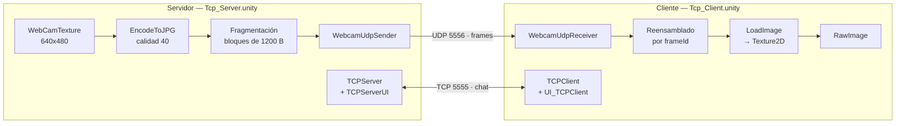
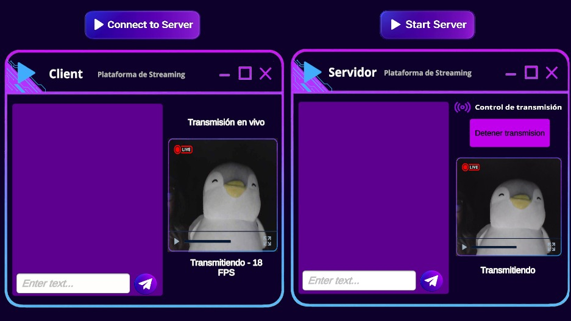

<div align="center">

# Plataforma de Streaming en Vivo — TCP + UDP

**Transmisión de video en tiempo real y chat bidireccional simultáneo sobre dos protocolos de transporte distintos.**

[](https://unity.com/)
[](https://learn.microsoft.com/dotnet/csharp/)
[](https://docs.unity3d.com/Packages/com.unity.render-pipelines.universal@17.5/)
[](#justificación-técnica-de-la-asignación-de-protocolos)
[](#justificación-técnica-de-la-asignación-de-protocolos)

</div>

---

## Tabla de contenido

- [Sobre el proyecto](#sobre-el-proyecto)
- [Arquitectura](#arquitectura)
- [Protocolo de aplicación para los frames](#protocolo-de-aplicación-para-los-frames)
- [TCP y UDP: fundamentos](#tcp-y-udp-fundamentos)
- [Justificación técnica de la asignación de protocolos](#justificación-técnica-de-la-asignación-de-protocolos)
- [Manejo de concurrencia](#manejo-de-concurrencia)
- [Instrucciones de ejecución](#instrucciones-de-ejecución)
- [Evidencia en la interfaz](#evidencia-en-la-interfaz)
- [Capturas de pantalla](#capturas-de-pantalla)
- [Video demostrativo](#video-demostrativo)
- [Estructura del repositorio](#estructura-del-repositorio)
- [Autores](#autores)

---

## Sobre el proyecto

Este proyecto es un *fork* de la base **Chat-TCP-UDP-base** entregada en clase. Sobre esa base cliente-servidor se construyó una aplicación que simula una **plataforma de streaming en vivo** en Unity, en la que el servidor transmite una secuencia continua de imágenes capturadas de una cámara web y, de forma **simultánea e independiente**, cliente y servidor intercambian mensajes de texto.

El requisito central del enunciado es que **cada flujo viaje por un protocolo de transporte distinto** y que ambos operen a la vez sin bloquearse. La asignación adoptada es:

| Flujo | Dirección | Protocolo | Puerto |
| :--- | :--- | :--- | :--- |
| Transmisión de frames | Servidor → Cliente | **UDP** | `5556` |
| Chat de texto | Servidor ↔ Cliente | **TCP** | `5555` |

### Características

- **Transmisión de frames en tiempo real** a 20 FPS configurables, percibida como video fluido.
- **Fragmentación y reensamblado propios** a nivel de aplicación, necesarios porque una imagen JPEG no cabe en un solo datagrama UDP.
- **Descarte de frames obsoletos e incompletos**, para que la latencia no se acumule cuando hay pérdida de paquetes.
- **Chat bidireccional concurrente**, con burbujas estilo mensajería y desplazamiento automático.
- **Control explícito de la transmisión** (iniciar / detener) sin afectar la conexión de chat.
- **Indicadores de estado en pantalla**: conexión, transmisión activa o detenida, y FPS recibidos en vivo.

### Construido con

| Tecnología | Versión / Detalle |
| :--- | :--- |
| Unity | `6000.5.7f1` |
| Universal Render Pipeline | `17.5.0` |
| TextMesh Pro | Incluido en el proyecto |
| `System.Net.Sockets` | `TcpListener`, `TcpClient`, `UdpClient` |
| Codificación de imagen | `Texture2D.EncodeToJPG` / `Texture2D.LoadImage` |
| Captura | `WebCamTexture` |

---

## Arquitectura

La aplicación se compone de **dos escenas cargadas simultáneamente** mediante *multi-scene editing*: una representa el servidor y la otra el cliente. Ambas se ejecutan en la misma máquina sobre la interfaz de *loopback* (`127.0.0.1`), lo que permite observar los dos extremos en pantalla al mismo tiempo.



### Scripts en uso

| Script | Rol | Protocolo |
| :--- | :--- | :--- |
| `Interface/IChatConnection.cs` | Contrato común de conexión de chat (eventos y envío) | — |
| `Interface/IClient.cs` | Contrato del cliente (`ConnectToServer`, `isConnected`) | — |
| `Interface/IServer.cs` | Contrato del servidor (`StartServer`, `isServerRunning`) | — |
| `TCP/TCPServer.cs` | Escucha conexiones, recibe y envía mensajes de chat | TCP |
| `TCP/TCPClient.cs` | Se conecta al servidor, recibe y envía mensajes de chat | TCP |
| `TCP/UI/UI_TCPServer.cs` | Puente entre la UI del servidor y `TCPServer` | TCP |
| `TCP/UI/UI_TCPClient.cs` | Puente entre la UI del cliente y `TCPClient` | TCP |
| `TCP/UI/ChatLogUI.cs` | Instancia una burbuja por mensaje y controla el scroll | — |
| `VIdeo/WebcamUdpSender.cs` | Captura, comprime, fragmenta y envía los frames | UDP |
| `VIdeo/WebcamUdpReceiver.cs` | Recibe, reensambla, decodifica y muestra los frames | UDP |

> **Nota sobre el fork.** Los scripts `UDP/UDPClient.cs`, `UDP/UDPServer.cs`, `UDP/UI/UI_UdpClient.cs`, `UDP/UI/UI_UdpServer.cs` y los borradores `VIdeo/UdpVideoClient.cs`, `VIdeo/UdpVideoServer.cs`, `VIdeo/VideoReceiver.cs`, `VIdeo/VideoSender.cs` pertenecen a la base original y se conservan sin modificar como evidencia de la línea del fork, junto con sus escenas de demostración (`Scenes/UDP/`, `Scenes/Video/`). **No forman parte de la aplicación final.** La implementación de video se reescribió en `WebcamUdpSender` / `WebcamUdpReceiver` porque el borrador de la base enviaba cada imagen en un único datagrama, sin cabecera ni fragmentación, lo que impide transmitir imágenes que superen el tamaño máximo de un datagrama y no permite reensamblar ni descartar frames.

### Escenas

| Escena | Contenido |
| :--- | :--- |
| `Assets/Chat_TCP_UDP/Scenes/TCP/Tcp_Server.unity` | Panel del servidor: chat, vista previa de la cámara, control de transmisión |
| `Assets/Chat_TCP_UDP/Scenes/TCP/Tcp_Client.unity` | Panel del cliente: chat, pantalla de video, indicador de estado y FPS |

---

## Protocolo de aplicación para los frames

UDP entrega **datagramas independientes y de tamaño acotado**. Una imagen JPEG de 640×480 pesa habitualmente entre 20 KB y 40 KB, muy por encima de la MTU típica de 1500 bytes, por lo que enviarla en un único datagrama provoca fragmentación a nivel IP: si se pierde un solo fragmento, se pierde la imagen completa y el sistema no tiene forma de detectarlo.

Por eso se define un **protocolo de aplicación propio**: cada frame se parte en bloques de 1200 bytes y cada bloque viaja con una cabecera de 8 bytes que permite reconstruirlo en destino.

```text
 offset:  0        4        6        8                            ≤ 1208 B
          ├────────┼────────┼────────┼─────────────────────────────┤
          │frameId │chunkIdx│chunkCnt│        payload JPEG         │
          │ int32  │ uint16 │ uint16 │        ≤ 1200 bytes         │
          └────────┴────────┴────────┴─────────────────────────────┘
```

| Campo | Tipo | Descripción |
| :--- | :--- | :--- |
| `frameId` | `int32` | Número de frame, incremental. Permite ordenar y descartar frames viejos. |
| `chunkIndex` | `uint16` | Posición de este bloque dentro del frame. |
| `chunkCount` | `uint16` | Total de bloques que componen el frame. |
| `payload` | `byte[]` | Porción de los bytes JPEG. |

**Ciclo de emisión** (`WebcamUdpSender`)

1. Se copian los píxeles de la `WebCamTexture` a una `Texture2D` reutilizada.
2. Se comprime con `EncodeToJPG(jpegQuality)`.
3. Se calcula `chunkCount` y se incrementa `frameId`.
4. Se emiten los `chunkCount` datagramas, cada uno con su cabecera.
5. Se repite según el intervalo `1 / fps`.

**Ciclo de recepción** (`WebcamUdpReceiver`)

1. Se descartan de entrada los paquetes cuyo `frameId` sea menor o igual al último frame ya mostrado.
2. Los bloques se acumulan en un diccionario indexado por `frameId`.
3. Al completarse un frame (`filled == total`), se concatenan los bloques en orden y se entrega al hilo principal.
4. Se purgan del diccionario los frames incompletos más antiguos, evitando que la memoria crezca ante pérdidas.
5. En el hilo principal, `Texture2D.LoadImage` decodifica el JPEG y se asigna al `RawImage`.

Si dos frames se completan antes de que Unity dibuje un cuadro, **solo se muestra el más reciente**. Esta política de descarte es lo que mantiene la latencia baja: se prefiere perder una imagen antes que acumular retraso.

---

## TCP y UDP: fundamentos

**TCP** (*Transmission Control Protocol*) es un protocolo **orientado a conexión**. Antes de transmitir datos establece un circuito lógico mediante un saludo de tres vías, y a partir de ahí garantiza que los bytes lleguen **completos, sin duplicados y en el mismo orden** en que se enviaron. Lo consigue numerando los segmentos, exigiendo confirmaciones (*ACK*) y retransmitiendo lo que no se confirma. Además regula el ritmo de envío mediante control de flujo y de congestión. Ese conjunto de garantías tiene un costo: la retransmisión de un segmento perdido **bloquea la entrega de todo lo que venga detrás** hasta que ese hueco se resuelva, fenómeno conocido como *head-of-line blocking*, que se traduce en picos de latencia impredecibles.

**UDP** (*User Datagram Protocol*) es un protocolo **sin conexión**. Envía datagramas independientes sin establecer sesión, sin confirmaciones, sin retransmisión y sin control de congestión. No garantiza entrega, ni orden, ni unicidad. A cambio, la cabecera es mínima (8 bytes frente a 20 o más de TCP) y el envío no queda nunca a la espera de una confirmación: cada datagrama sale de inmediato y llega, o no llega, pero **nunca retrasa al siguiente**.

| Criterio | TCP | UDP |
| :--- | :--- | :--- |
| Conexión | Orientado a conexión | Sin conexión |
| Fiabilidad | Entrega garantizada | Entrega no garantizada |
| Orden | Preservado | No preservado |
| Retransmisión | Automática | Inexistente |
| Control de congestión | Sí | No |
| Cabecera | ≥ 20 bytes | 8 bytes |
| Latencia | Variable (*head-of-line blocking*) | Baja y estable |
| Uso típico | Mensajería, archivos, HTTP | Voz, video en vivo, juegos |

---

## Justificación técnica de la asignación de protocolos

### UDP para la transmisión de frames

La decisión se sustenta en la **naturaleza del dato transmitido**: en un video en vivo, cada frame tiene valor únicamente durante los ~50 ms en que debe mostrarse. Pasado ese instante, la imagen es información obsoleta.

1. **Un frame perdido se sustituye solo.** Si el frame *n* no llega completo, el frame *n+1* ya viene en camino con la escena actualizada. Retransmitir el frame *n* significaría mostrar una imagen del pasado: el remedio sería peor que la pérdida.
2. **Ausencia de *head-of-line blocking*.** Con TCP, un solo segmento perdido detendría la entrega de todos los frames posteriores hasta completar la retransmisión, produciendo el congelamiento de la imagen seguido de un salto brusco. Con UDP, los datagramas de frames posteriores se siguen entregando con normalidad.
3. **Sin control de congestión que degrade el ritmo.** TCP reduce automáticamente su ventana ante pérdidas, lo que se traduce en caídas de la tasa de frames. UDP mantiene la cadencia fijada por la aplicación.
4. **Menor sobrecarga por datagrama.** Una cabecera de 8 bytes frente a 20 o más importa cuando se emiten cientos de paquetes por segundo.
5. **El control necesario se implementa a medida.** El proyecto no renuncia al control: reconstruye los frames con su propia cabecera y aplica una política de descarte *(el frame más reciente gana)* que TCP no podría ofrecer, porque TCP está obligado a entregarlo todo.

### TCP para el chat

El requisito del texto es exactamente el opuesto al del video:

1. **Ningún mensaje puede perderse.** Un frame perdido pasa desapercibido; un mensaje de chat perdido rompe la conversación. TCP garantiza la entrega mediante confirmación y retransmisión.
2. **El orden es semántico.** Una conversación leída en desorden cambia de sentido. TCP preserva el orden de los bytes; UDP obligaría a implementar numeración y reordenamiento a mano.
3. **La latencia no es crítica.** Unas decenas de milisegundos adicionales por una retransmisión son imperceptibles para una persona escribiendo.
4. **El volumen es despreciable.** Los mensajes son cadenas cortas y esporádicas; el costo de las garantías de TCP es irrelevante frente al beneficio.
5. **La conexión persistente modela el estado.** El socket TCP permite detectar de forma natural cuándo el interlocutor se conecta o se desconecta, información que la interfaz utiliza directamente.

### Verificación de la decisión inversa

Asignar TCP a los frames y UDP al chat degradaría ambos flujos: el video sufriría congelamientos y saltos ante cualquier pérdida, mientras que el chat podría perder mensajes o mostrarlos desordenados sin ninguna ganancia a cambio. La asignación adoptada es la que utilizan los protocolos de *streaming* y videoconferencia en producción, donde el transporte de medios es no fiable y los canales de control y mensajería sí lo son.

---

## Manejo de concurrencia

Los dos flujos son **independientes en socket, en puerto y en modelo de ejecución**, de modo que ninguno puede bloquear al otro.

| Flujo | Modelo | Detalle |
| :--- | :--- | :--- |
| Chat (TCP) | `async` / `await` sobre `Task` | `ReceiveLoop` espera en `NetworkStream.ReadAsync` sin ocupar el hilo. Las continuaciones regresan al hilo principal mediante el contexto de sincronización de Unity, por lo que los manejadores pueden tocar la interfaz de forma segura. |
| Frames (UDP) | `BeginReceive` / `EndReceive` (ThreadPool) | El reensamblado ocurre íntegramente en el hilo de red. Las llamadas se encadenan, de modo que solo hay una recepción pendiente y el acceso al diccionario de reensamblado no requiere bloqueo. |

**Frontera entre hilos.** El único dato compartido entre el hilo de red y el hilo principal es el último frame JPEG completo, protegido por un `lock` sobre un objeto dedicado. El hilo de red deposita el arreglo de bytes; `Update()` lo retira y lo consume. La API gráfica de Unity (`LoadImage`, asignación de texturas) se invoca exclusivamente desde el hilo principal, como exige el motor.

**Ritmo de emisión.** El envío no usa `Thread.Sleep` ni bloquea: se acumula `Time.deltaTime` y se emite un frame cuando se supera el intervalo `1 / fps`. Detener la transmisión no cierra ningún socket, por lo que el chat continúa operando sin interrupción.

**Robustez en Windows.** Ambos sockets UDP desactivan `SIO_UDP_CONNRESET`. Sin esta medida, un datagrama enviado a un puerto que todavía no escucha genera un ICMP *port unreachable* que hace fallar la siguiente operación de recepción del socket, interrumpiendo el bucle de forma permanente. Adicionalmente, los ciclos de recepción capturan cualquier excepción y se rearman, y el saludo inicial del cliente se reenvía periódicamente hasta recibir el primer frame, lo que hace el arranque independiente del orden en que se inicien ambos extremos.

---

## Instrucciones de ejecución

### Requisitos previos

- **Unity 6000.5.7f1** o superior (Unity Hub).
- Una **cámara web** disponible en el equipo.
- Sistema operativo Windows, macOS o Linux.

### Instalación

```bash
git clone https://github.com/juanestebanmendez88-hash/Chat-TCP-UDP-base.git
cd Chat-TCP-UDP-base
```

Abre la carpeta como proyecto desde **Unity Hub**. La primera importación puede tardar varios minutos.

### Puesta en marcha

1. Abre la escena **`Assets/Chat_TCP_UDP/Scenes/TCP/Tcp_Server.unity`**.
2. En el panel *Project*, **arrastra** `Assets/Chat_TCP_UDP/Scenes/TCP/Tcp_Client.unity` a la ventana *Hierarchy* para cargarla de forma **aditiva**. Ambos paneles quedan visibles a la vez.
3. Pulsa **Play**.
4. Sigue esta secuencia en la interfaz:

   | Paso | Acción | Resultado esperado |
   | :--- | :--- | :--- |
   | 1 | **Start Server** (panel servidor) | Abre el socket TCP `5555` y el UDP `5556`; aparece la vista previa de la cámara. Estado: *Servidor activo - sin cliente*. |
   | 2 | **Connect to Server** (panel cliente) | Conecta el chat y envía el saludo UDP. Cliente: *Conectado - esperando video*. Servidor: *Cliente conectado - transmision detenida*. |
   | 3 | **Iniciar transmision** (panel servidor) | Comienza el envío de frames. Cliente: *Transmitiendo - N FPS* y video en pantalla. |
   | 4 | Escribir y **Send Message** en cualquiera de los dos paneles | El mensaje aparece como burbuja en ambos, **sin interrumpir el video**. |
   | 5 | **Detener transmision** | El video se detiene, el chat sigue funcionando. |

> Al ejecutarse por primera vez, el sistema operativo puede solicitar autorización para usar la cámara. Es necesario concederla.

### Parámetros ajustables

Seleccionando el objeto `VideoSender` en la escena del servidor:

| Parámetro | Valor por defecto | Efecto |
| :--- | :--- | :--- |
| `Fps` | `20` | Frames enviados por segundo. Subirlo mejora la fluidez y aumenta el ancho de banda. |
| `Jpeg Quality` | `40` | Calidad de compresión (5–90). Bajarlo reduce el peso de cada frame. |
| `Requested Width` / `Height` | `640` × `480` | Resolución solicitada a la cámara. Menor resolución implica frames más ligeros. |
| `Port` | `5556` | Puerto UDP del flujo de video. Debe coincidir con `Server Port` del cliente. |

Si el video se percibe entrecortado, la vía recomendada es **reducir primero `Jpeg Quality`** y después la resolución, antes que bajar los FPS.

---

## Evidencia en la interfaz

La interfaz expone el estado de ambos flujos de forma permanente:

**Panel del servidor** — etiqueta de estado del flujo de video:

| Estado mostrado | Significado |
| :--- | :--- |
| `Servidor de video detenido` | Aún no se ha pulsado *Start Server*. |
| `Servidor activo - sin cliente` | Socket UDP abierto, ningún cliente se ha anunciado. |
| `Cliente conectado - transmision detenida` | Cliente identificado, sin envío de frames. |
| `Transmitiendo` | Frames saliendo hacia el cliente. |

El botón de transmisión alterna su rótulo entre **Iniciar transmision** y **Detener transmision**, reflejando el estado real.

**Panel del cliente** — etiqueta de recepción:

| Estado mostrado | Significado |
| :--- | :--- |
| `Desconectado` | Aún no se ha pulsado *Connect to Server*. |
| `Conectado - esperando video` | Socket listo, todavía no llega ningún frame. |
| `Transmitiendo - N FPS` | Recepción activa; `N` es el conteo real de frames mostrados en el último segundo. |
| `Transmision detenida` | Se recibieron frames y el flujo se interrumpió. |

**Chat** — la llegada de mensajes se evidencia con burbujas: los propios alineados a la derecha en verde, los del interlocutor a la izquierda en blanco, con desplazamiento automático al último mensaje.

El contador de FPS constituye la prueba de que la recepción es continua y en tiempo real, y de que **el chat no la degrada**: el valor se mantiene estable mientras se intercambian mensajes.

---

## Capturas de pantalla

| Vista | Imagen |
| :--- | :--- |
| Aplicación completa: video y chat simultáneos |  |
| Panel del servidor con transmisión activa |  |
| Panel del cliente recibiendo frames |  |
| Chat bidireccional durante la transmisión |  |
| Estados de conexión y transmisión detenida |  |

> Las imágenes se ubican en `docs/img/` en formato `.png`.

---

## Video demostrativo

**YouTube:** `<enlace pendiente>`

El video evidencia:

- Transmisión de frames en tiempo real funcionando.
- Chat operando de forma simultánea a la transmisión.
- Qué protocolo corre cada flujo (chat sobre TCP `5555`, frames sobre UDP `5556`), verificable mediante los indicadores de la interfaz y la consola de Unity.

---

## Estructura del repositorio

```text
Chat-TCP-UDP-base/
├── Assets/
│   └── Chat_TCP_UDP/
│       ├── Scenes/
│       │   ├── TCP/          # Escenas de la aplicación final (servidor y cliente)
│       │   ├── UDP/          # Demo de chat UDP de la base original (no usada)
│       │   └── Video/        # Demo de video de la base original (no usada)
│       └── Scripts/
│           ├── Interface/    # IChatConnection, IClient, IServer
│           ├── TCP/          # TCPServer, TCPClient y su capa de UI
│           ├── UDP/          # Chat UDP de la base original (no usado)
│           └── VIdeo/        # WebcamUdpSender, WebcamUdpReceiver y borradores de la base
├── docs/
│   └── img/                  # Capturas de pantalla
├── Packages/
├── ProjectSettings/
└── README.md
```

---

## Autores

| Nombre | Rol |
| :--- | :--- |
| Juan Esteban Méndez | Desarrollo |
| *(integrante 2)* | — |
| *(integrante 3)* | — |

**Repositorio:** <https://github.com/juanestebanmendez88-hash/Chat-TCP-UDP-base>

Proyecto académico desarrollado como *fork* de la base **Chat-TCP-UDP-base** para el curso de Servicios Telemáticos, Ingeniería Multimedia.
